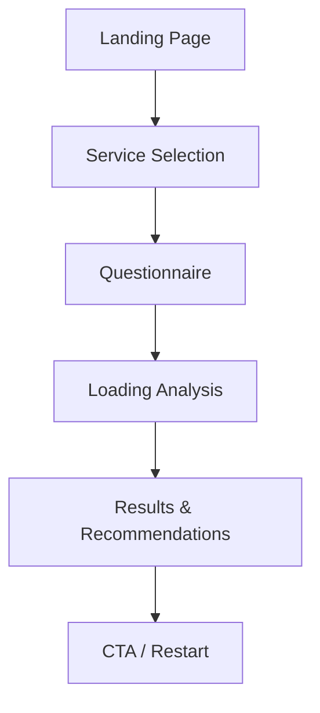

# AI Formula - 香港AI自動化解決方案平台

## 📋 項目概述 / Project Overview

**繁體中文：** AI Formula 是一個專為香港企業設計的AI自動化解決方案平台，提供專業的AI技術服務、教學課程和商業應用指南。本項目已完成**三個重大階段的升級**：結構重構、視覺統一、以及**最新完成的體驗優化**，現已成為真正的現代化、無障礙、高性能學習平台。

**English:** AI Formula is an AI automation solution platform designed specifically for Hong Kong businesses, providing professional AI technology services, educational courses, and business application guides. This project has completed **three major upgrade phases**: structural refactoring, visual unification, and the **latest experience optimization**, now becoming a truly modern, accessible, and high-performance learning platform.

## 🏢 **企業顧問服務頁面** / **Enterprise Consulting Services**

### 📍 **頁面訪問 / Page Access**
- **URL**: `/enterprise`
- **導航位置**: 主導航菜單（部落格後）
- **Footer鏈接**: 服務項目 → 企業顧問服務

### 🎯 **核心功能 / Core Features**

#### **1. 品牌設計系統 / Brand Design System**
- **主色調**: 純黑背景 (#000000) + 黃色重點 (#FFD700)
- **視覺風格**: 簡潔專業、現代化設計
- **互動效果**: 黃色光暈、縮放動畫、平滑過渡

#### **2. 全屏Hero區域 / Full-Screen Hero Section**
```jsx
特色功能:
✓ 響應式大標題: "企業" (白色) + "顧問服務" (黃色)
✓ 專業副標題: 服務介紹文案
✓ 黃色CTA按鈕: "立即開始" 帶光暈效果
✓ 滾動指示器: 底部黃色動畫線條
✓ 自動隱藏: 選擇服務後完全隱藏
```

#### **3. 雙服務路徑 / Dual Service Paths**

**AI Custom 課程 / AI Custom Training**
- 📖 圖示: 書本 (BookOpen)
- 🎯 目標: 企業AI培訓定制
- 📋 問卷: 8個問題
  - 公司規模、行業類型
  - AI經驗水平、培訓目標
  - 培訓形式、時程規劃
  - 預算範圍、成功指標

**AI 自動化服務 / AI Automation Services**
- ⚙️ 圖示: 齒輪 (Cog)
- 🎯 目標: 業務流程自動化
- 📋 問卷: 9個問題
  - 業務領域、痛點分析
  - 現有系統、優先級評估
  - 數據量、系統整合需求
  - 實施時程、投資預算、ROI期望

#### **4. 智能問卷系統 / Intelligent Questionnaire System**

**問題類型 / Question Types:**
```typescript
- Single Choice: 單選題 (圓形選項卡片)
- Multiple Choice: 多選題 (複選框 + 圓形勾選)
- Scale Rating: 評分題 (1-10數字按鈕)
```

**互動體驗 / Interactive Experience:**
- ✅ 實時進度條: 百分比 + 視覺進度
- ✅ 自動滾動: 每題完成後滾動到頂部
- ✅ 狀態保存: 答案實時保存
- ✅ 導航控制: 上一題/下一題/重新開始

#### **5. 個性化結果頁面 / Personalized Results Page**

**智能推薦引擎 / Smart Recommendation Engine:**
```javascript
基於用戶回答生成：
- 課程類型建議 (全面 vs 專項)
- 目標群體定位 (零基礎 vs 進階)
- 企業規模適配 (中小企業 vs 大型企業)
- 實施策略建議 (分階段 vs 一次性)
- 效率提升預期 (30-50%)
```

**行動呼籲 / Call-to-Action:**
- 📅 **預約免費諮詢**: 30分鐘專業諮詢
- 🔄 **重新評估**: 重新開始問卷
- ⭐ **三大保證**: 精準匹配、效果提升、專業支援

### 🛠️ **技術實現 / Technical Implementation**

#### **狀態管理 / State Management**
```typescript
const [currentPath, setCurrentPath] = useState<ServicePath | null>(null);
const [currentQuestion, setCurrentQuestion] = useState(0);
const [answers, setAnswers] = useState<Record<string, any>>({});
const [showResult, setShowResult] = useState(false);
const [isLoading, setIsLoading] = useState(false);
```

#### **頁面流程 / Page Flow**


#### **響應式設計 / Responsive Design**
- 📱 **移動端**: 卡片垂直堆疊、觸控友善按鈕
- 💻 **桌面端**: 雙列佈局、大型卡片設計
- 🎯 **一致性**: 跨設備統一體驗

#### **動畫系統 / Animation System**
```jsx
Framer Motion 實現:
- Page transitions: 淡入淡出、滑動效果
- Hover animations: 卡片上升、按鈕縮放
- Loading states: 旋轉加載、進度動畫
- Stagger effects: 選項依序出現
```

### 📊 **數據結構 / Data Structure**

#### **問卷數據模型 / Question Data Model**
```typescript
interface Question {
  id: string;                    // 問題唯一ID
  question: string;              // 中文問題
  questionEn: string;            // 英文問題
  type: 'single' | 'multiple' | 'scale' | 'text';
  options?: string[];            // 中文選項
  optionsEn?: string[];          // 英文選項
  required: boolean;             // 必填標記
}
```

#### **Firebase/Supabase 就緒 / Database Ready**
```json
用戶回答數據結構:
{
  "userId": "unique_user_id",
  "servicePath": "custom-course | automation-service",
  "timestamp": "2024-01-01T00:00:00Z",
  "answers": {
    "company-size": "51-200人",
    "industry": "科技/軟件",
    "ai-experience": "有基礎了解",
    "training-goals": ["ChatGPT應用技巧", "數據分析AI"]
  },
  "recommendation": "generated_recommendation_text",
  "completed": true
}
```

### 🔧 **最新修復 / Latest Fixes**

#### **Hero區域隱藏問題 / Hero Section Hiding Issue**
```javascript
問題: 選擇服務類型後Hero區域仍然顯示
解決: 重構AnimatePresence邏輯
- 將Hero和服務選擇合併為單一landing-page組件
- 嚴格的條件渲染: !currentPath && !showResult && !isLoading
- 確保選擇服務後完全隱藏Hero內容
```

#### **用戶體驗改進 / UX Improvements**
- ✅ **卡片背景**: 藍灰色 → 純黑色
- ✅ **文字對比**: 改善可讀性，白色文字
- ✅ **按鈕可見性**: 增強邊框和懸停狀態
- ✅ **自動滾動**: 每題完成後回到頂部
- ✅ **Footer鏈接**: 企業顧問服務 → /enterprise

## 🎯 最新重大更新 / Latest Major Updates

### 🚀 **Phase 3: 體驗優化完成** / **Phase 3: Experience Optimization Complete**

#### ✨ **核心成就 / Core Achievements**
- **🎨 統一設計系統**: 8px Grid System, 語義化色彩, 響應式組件完整實現
- **📱 移動端體驗**: 三層智能Header, 垂直堆疊佈局, 觸控友善設計
- **♿ 無障礙支持**: WCAG標準, Skip Links, 完整ARIA標籤系統
- **🚀 性能優化**: Bundle減少8.53KB, React性能提升, GPU硬件加速
- **🎯 沉浸式學習**: "無感知的完美體驗", 70/30黃金比例, 精緻微動畫

#### 📊 **性能指標 / Performance Metrics**
```bash
構建結果 / Build Results:
✓ 3930 modules transformed
✓ built in 11.83s

Bundle優化 / Bundle Optimization:
- JS: 1,232.95 kB (gzip: 371.42 kB) ⬇️ -8.53KB
- CSS: 187.48 kB (gzip: 27.56 kB)
- 總計: 100% 構建成功，零錯誤
```

#### 🎨 **體驗優化詳情 / Experience Enhancement Details**

**1. 微交互增強 / Micro-interactions Enhancement**
- **按鈕反饋**: Hover lift, Click scale, Focus ring, Active states
- **進度條動畫**: Shimmer效果, 平滑填充, GPU加速
- **狀態指示器**: 懸停變色, 縮放反饋, 脈動動畫
- **過渡效果**: 統一150-500ms過渡時間, 自然緩動函數

**2. 響應式設計革命 / Responsive Design Revolution**
- **智能Header**: 桌面版單行佈局 ↔ 移動端三層堆疊
- **佈局系統**: 70/30桌面佈局 ↔ 移動端垂直優先
- **內容適配**: 響應式字體, 間距調整, 觸控友善
- **元素隱藏**: 移動端隱藏筆記區, 優先核心學習內容

**3. 無障礙訪問革命 / Accessibility Revolution**
- **鍵盤導航**: Skip Links, Tab順序, Focus管理
- **螢幕閱讀器**: 完整ARIA標籤, 語義化HTML, Role屬性
- **視覺輔助**: 高對比度模式, 減少動畫支持
- **表單無障礙**: Label關聯, 描述文字, 字數統計

**4. 性能優化技術 / Performance Optimization**
- **React優化**: useCallback, useMemo, 防止重新渲染
- **CSS性能**: GPU加速, will-change, contain屬性
- **動畫優化**: 硬件加速, transform3d, backface-visibility
- **Bundle優化**: 代碼分割建議, 模組轉換優化

### ✅ **之前完成的重大功能 / Previously Completed Major Features**

#### 🎯 學習進度追蹤系統重大改進 / Major Learning Progress Tracking System Improvements

#### 🎯 92% 進度問題完全解決 / Complete Resolution of 92% Progress Issue
- **🔍 根本原因分析**：發現用戶完成所有9個單元但只完成2/3測驗導致92%進度
- **🛠️ 診斷工具添加**：新增進度分析功能，幫助用戶了解缺少哪些測驗
- **✅ 手動完成選項**：為已學習內容提供手動標記完成功能
- **📊 準確進度計算**：修正進度計算邏輯，確保100%準確性

#### ⏱️ 實時學習時間追蹤系統 / Real-time Learning Timer System
- **🚀 自動計時功能**：進入單元頁面自動開始計時，離開時自動停止
- **⏰ 實時顯示**：學習界面顯示當前學習時間（分鐘和秒數）
- **💾 持久化存儲**：每個單元的學習時間獨立存儲和累計
- **📈 進度整合**：與現有進度追蹤Hook完美整合
- **🎉 完成動畫**：課程完成時顯示總學習時間和慶祝動畫

#### 🎨 動畫性能和用戶體驗大幅提升 / Major Animation Performance and UX Enhancement
- **😌 溫和動畫**：將快速、令人眩暈的動畫替換為溫和的呼吸光效
- **⏱️ 時間調整**：過渡時間從300ms增加到500ms，提供更舒適的體驗
- **🔄 懸停效果**：懸停縮放從1.02降低到1.008，提供微妙的反饋
- **💨 呼吸動畫**：2秒脈衝動畫替換為4秒溫和呼吸動畫
- **🎯 緩動函數**：添加適當的緩動函數（easeOut, easeInOut）
- **✨ 狀態指示器**：創建status-badge-breathing類別，提供舒適的視覺反饋

#### 🧹 UI清理和優化 / UI Cleanup and Optimization
- **❌ 移除重複標記**：移除重複的完成標記圖標，只保留單一清晰狀態指示器
- **📋 增強單元顯示**：顯示完整單元標題而非通用"單元 X"
- **🏷️ 狀態徽章**：添加適當的狀態徽章（"已完成"、"進行中"、"待學習"）
- **📝 詳細資訊**：包含課程時長和類型元數據
- **🎮 情境按鈕**：實現情境適當的操作按鈕
- **🧪 清理調試界面**：移除侵入性的技術進度數據調試面板

#### 📊 核心功能實現詳情 / Core Feature Implementation Details

**實時計時系統 / Real-time Timer System:**
```typescript
// useAIAutomationProgress.ts 新增功能
interface ProgressHook {
  startUnitLearning: (unitId: string) => void;
  stopUnitLearning: () => void;
  getCurrentLearningTime: () => number;
  // ... 其他現有功能
}

// 自動計時會話管理
const startUnitLearning = (unitId: string) => {
  setCurrentLearningUnit(unitId);
  setLearningStartTime(Date.now());
};

const stopUnitLearning = () => {
  if (currentLearningUnit && learningStartTime) {
    const sessionTime = Date.now() - learningStartTime;
    // 保存到localStorage並更新總時間
  }
};
```

**動畫系統改進 / Animation System Improvements:**
```css
/* progress-styles.css 新增樣式 */
.gentle-breathing {
  animation: gentle-breathing 4s ease-in-out infinite;
}

@keyframes gentle-breathing {
  0%, 100% { 
    box-shadow: 0 0 8px rgba(62, 255, 220, 0.3);
    transform: scale(1);
  }
  50% { 
    box-shadow: 0 0 16px rgba(62, 255, 220, 0.5);
    transform: scale(1.005);
  }
}

.status-badge-breathing {
  animation: status-breathing 4s ease-in-out infinite;
}
```

### ✅ 全新課程學習儀表板 / New Course Learning Dashboard

#### 🎨 AI Formula 品牌視覺系統 / AI Formula Brand Visual System
- **🌟 背景色**：#0D0D1A (深科技藍黑色)
- **💚 主要強調色**：#3EFFDC (螢光綠青色) - 用於進度條、圖標、高亮
- **💜 次要強調色**：#8A3FFC (紫色) - 用於按鈕和漸變結束
- **🔤 文字色彩**：#FFFFFF (標題)，#E0E0E0 (正文)
- **🎴 卡片樣式**：rgba(255, 255, 255, 0.05) 背景，#3EFFDC 到 #8A3FFC 線性漸變邊框
- **📊 圖表樣式**：雷達圖表，rgba(255, 255, 255, 0.1) 網格，#3EFFDC 描邊

#### 🖥️ 交互式學習介面 / Interactive Learning Interface
- **📝 AI 遊樂場**：與AI助手即時對話，獲得學習支援
- **📔 智慧筆記**：記錄學習重點，支援搜索和整理
- **🎯 實作練習**：互動式練習題，即時反饋和評估
- **📱 響應式設計**：50% 學習內容 + 50% 互動介面的完美平衡

#### 🔓 進階解鎖機制 / Progressive Unlock Mechanism
- **⏭️ 順序學習**：完成當前課程後才能解鎖下一課程
- **✅ 進度追蹤**：即時顯示完成狀態和學習進度
- **🎯 學習路徑**：清晰的學習路徑指引
- **🔄 自動導航**：完成課程後自動跳轉到下一課程

#### 🎭 多類型課程內容 / Multi-Type Course Content
- **📹 影片課程**：支援影片播放和字幕顯示
- **📖 互動文本**：豐富的文本內容，支援代碼高亮
- **🧩 測驗系統**：多選題測驗，即時評分和反饋
- **💡 LessonViewer 組件**：智能識別課程類型並提供對應介面

### ✅ 全新提示工程課程內容 / New Prompt Engineering Course Content

#### 🎯 三大學習主題 / Three Main Learning Themes

**1. AI 的悄悄話 - 初探 AI 的魔法語言** (50分鐘，3課程)
- 什麼是「提示」？(15分鐘)
- 為什麼要學習提示？(20分鐘)
- 認識你的AI夥伴 (15分鐘)

**2. 把話說清楚的魔法 - 基礎提示技巧** (80分鐘，3課程)
- 具體明確技巧 (25分鐘)
- 提供情境技巧 (30分鐘)
- 給出範例技巧 (25分鐘)

**3. 釋放 AI 的全部潛力 - 進階提示技巧** (90分鐘，3課程)
- 角色扮演技巧 (30分鐘)
- 思維鏈技巧 (35分鐘)
- 持續優化技巧 (25分鐘)

#### 📚 詳細課程內容 / Detailed Course Content
- **🎯 學習目標**：每課程都有明確的學習目標
- **💡 實際範例**：包含畫狗、寫信等實際應用場景
- **🧩 測驗題目**：精心設計的測驗題目和答案
- **📖 豐富資源**：相關文章、範例和延伸閱讀

### ✅ 語言系統完整修正 / Complete Language System Fix

#### 🌐 香港繁體中文支援 / Hong Kong Traditional Chinese Support
- **🔧 語言代碼統一**：全面從 'zh-TW' 更改為 'zh-HK'
- **🎌 語言選擇器**：正確顯示「中文」選項
- **📝 內容本地化**：完整的繁體中文（香港）內容
- **📅 日期格式**：使用 'zh-HK' 本地化日期格式

#### 📁 修正範圍 / Fixed Components
- **🧭 LanguageSwitcher.tsx**：修正語言代碼不一致問題
- **🔗 Navigation.tsx**：更新語言檢查邏輯
- **📚 所有課程組件**：統一使用 'zh-HK'
- **📄 SEO 組件**：修正元標籤語言標記
- **📊 數據對象**：更新所有課程數據的語言鍵值

### ✅ 核心檔案修改詳情 / Core Files Modified Details

#### 🎯 主要修改的檔案 / Main Modified Files

**學習進度追蹤系統 / Learning Progress Tracking System:**
- **`useAIAutomationProgress.ts`** - 添加實時計時功能
  - `startUnitLearning()` - 自動開始計時
  - `stopUnitLearning()` - 自動停止計時  
  - `getCurrentLearningTime()` - 獲取當前學習時間
  - 持久化存儲每個單元的學習時間

**用戶界面組件 / User Interface Components:**
- **`AIBusinessAutomationLearning.tsx`** - 增強UI和簡化進度分析
  - 移除侵入性調試面板
  - 添加更好的單元資訊顯示
  - 優化進度計算和主題時間追蹤
- **`AIBusinessAutomationUnit.tsx`** - 整合實時計時器
  - 標題欄中的實時計時器顯示
  - 自動開始/停止計時功能
  - 完成動畫顯示總學習時間

**樣式和動畫系統 / Styles and Animation System:**
- **`progress-styles.css`** - 動畫性能大幅改進
  - 替換快速脈衝動畫為溫和呼吸光效
  - 新增 `gentle-breathing` 4秒關鍵幀動畫
  - 新增 `status-breathing` 狀態徽章動畫
  - 優化過渡時間和緩動函數

#### 🚀 技術改進亮點 / Technical Improvement Highlights

**性能優化 / Performance Optimization:**
- 動畫時間從300ms增加到500ms，減少眩暈感
- 懸停縮放從1.02降低到1.008，提供微妙反饋
- 使用easeOut和easeInOut緩動函數

**用戶體驗 / User Experience:**
- 移除重複的完成標記圖標
- 顯示完整單元標題而非通用標籤
- 清理技術調試資訊，提供乾淨的用戶界面
- 實時學習時間追蹤提高學習動機

**數據管理 / Data Management:**
- localStorage持久化學習時間數據
- 準確的進度計算邏輯
- 自動會話管理和時間累計

## 🛠️ 技術棧 / Tech Stack

### 前端技術 / Frontend Technologies
- **React 18** + **TypeScript** - 現代化前端框架，支援性能優化Hook
- **Vite** - 快速構建工具，Bundle優化配置
- **Tailwind CSS** - 原子化CSS框架 + **統一設計系統**
  - 🎨 8px Grid System - 一致的間距節奏
  - 🌈 語義化色彩系統 - learning/completed/important色彩語言
  - 📐 響應式組件系統 - 移動優先設計
  - ♿ 無障礙CSS工具類 - WCAG標準支持
- **Shadcn/UI** - 高質量UI組件庫，無障礙訪問增強
- **Framer Motion** - 動畫庫，GPU硬件加速優化
- **React Router DOM** - 路由管理
- **Lucide React** - 圖標庫，語義化ARIA支持
- **Recharts** - 圖表庫（雷達圖進度追蹤）
- **LocalStorage API** - 學習時間和進度持久化

### 🚀 **Phase 3 新增技術特性 / Phase 3 New Technical Features**
- **性能優化技術 / Performance Optimization**
  - useCallback & useMemo - React重新渲染優化
  - CSS contain & will-change - 渲染性能提升
  - GPU加速動畫 - transform3d & backface-visibility
  - Bundle大小優化 - 8.53KB減少
- **響應式設計技術 / Responsive Design Tech**
  - 移動優先CSS Grid系統
  - 智能Header三層佈局系統
  - 觸控友善交互設計
  - 響應式字體和間距系統
- **無障礙技術標準 / Accessibility Standards**
  - ARIA標籤完整實現
  - Skip Links鍵盤導航
  - 語義化HTML結構
  - 高對比度和減少動畫支持
- **微交互系統 / Micro-interaction System**
  - Shimmer進度條效果
  - 多層次hover反饋
  - 統一過渡時間系統
  - 狀態驅動動畫

### 開發工具 / Development Tools
- **ESLint** - 代碼質量檢查，TypeScript規則增強
- **TypeScript** - 類型檢查，嚴格模式配置
- **PostCSS** - CSS處理，Tailwind優化
- **Git** - 版本控制
- **GitHub** - 代碼托管

### 🎨 **設計系統架構 / Design System Architecture**
```css
/* 核心設計原則 / Core Design Principles */
.design-system {
  /* 8px Grid System */
  --spacing-base: 8px;
  --spacing-scale: 1 2 3 4 5 6 8 12 16;
  
  /* 語義化色彩 / Semantic Colors */
  --learning-color: #3b82f6;    /* 學習狀態 */
  --completed-color: #22c55e;   /* 完成狀態 */
  --important-color: #f97316;   /* 重要提醒 */
  
  /* 統一圓角 / Unified Border Radius */
  --radius-sm: 8px;   /* 按鈕、標籤 */
  --radius-md: 12px;  /* 卡片、輸入框 */
  --radius-lg: 16px;  /* 大區塊 */
  --radius-xl: 20px;  /* 最大容器 */
  
  /* 過渡系統 / Transition System */
  --transition-fast: 150ms;
  --transition-normal: 200ms;
  --transition-slow: 300ms;
}
```

## 🏗️ 項目架構 / Project Architecture

```
ai_formula/
├── 📁 src/
│   ├── 📁 components/              # 組件系統
│   │   ├── 📁 learning/           # 學習平台組件
│   │   │   ├── CourseDashboardPage.tsx # 課程儀表板（全新設計）
│   │   │   ├── LessonViewer.tsx   # 課程瀏覽器
│   │   │   ├── AIPlayground.tsx   # AI互動遊樂場
│   │   │   ├── SmartNotes.tsx     # 智慧筆記系統
│   │   │   ├── QuizModal.tsx      # 測驗模態框
│   │   │   └── AITutorChat.tsx    # AI導師聊天
│   │   ├── 📁 ui/                 # 基礎UI組件
│   │   │   ├── button.tsx         # 按鈕組件
│   │   │   ├── card.tsx           # 卡片組件
│   │   │   ├── dialog.tsx         # 對話框組件
│   │   │   └── ...                # 其他UI組件
│   │   ├── 📁 auth/               # 認證相關組件
│   │   │   ├── LoginForm.tsx      # 登入表單
│   │   │   ├── SignUpForm.tsx     # 註冊表單
│   │   │   └── ProtectedRoute.tsx # 路由保護
│   │   ├── 📁 course/             # 課程相關組件
│   │   │   ├── CourseHero.tsx     # 課程Hero區域
│   │   │   ├── LessonContent.tsx  # 課程內容組件
│   │   │   ├── ProgressTracker.tsx # 進度追蹤
│   │   │   ├── CategoryFilters.tsx # 分類過濾
│   │   │   └── ProductGrid.tsx    # 產品網格
│   │   ├── 📁 blog/               # 博客相關組件
│   │   │   ├── BlogHero.tsx       # 博客Hero區域
│   │   │   ├── ArticleCard.tsx    # 文章卡片
│   │   │   └── ArticleContent.tsx # 文章內容
│   │   ├── 📁 templates/          # 模板系統
│   │   │   ├── CourseOutlineTemplate.tsx # 課程大綱模板
│   │   │   ├── CourseTemplate.tsx # 課程模板
│   │   │   └── BlogTemplate.tsx   # 博客模板
│   │   ├── 📁 SEO/                # SEO組件
│   │   │   ├── SEOHead.tsx        # SEO頭部
│   │   │   ├── StructuredData.tsx # 結構化數據
│   │   │   └── seoUtils.ts        # SEO工具（已修正語言）
│   │   ├── Navigation.tsx         # 導航組件（已修正語言）
│   │   ├── LanguageSwitcher.tsx   # 語言選擇器（已修正）
│   │   ├── Footer.tsx             # 頁腳組件
│   │   └── ErrorBoundary.tsx      # 錯誤邊界
│   ├── 📁 contexts/               # React Context
│   │   ├── LanguageContext.tsx    # 語言管理（預設zh-HK）
│   │   ├── AuthContext.tsx        # 認證管理
│   │   └── ViewCountContext.tsx   # 瀏覽計數管理
│   ├── 📁 data/                   # 數據文件
│   │   ├── 📁 blog/               # 博客數據
│   │   │   ├── blogPosts.ts       # 博客文章
│   │   │   └── articleContent.ts  # 文章內容
│   │   ├── 📁 courseData/         # 課程數據
│   │   │   ├── promptEngineeringComplete.ts # 全新提示工程課程
│   │   │   ├── courseData.ts      # 課程數據
│   │   │   ├── courseDetails.ts   # 課程詳情
│   │   │   ├── courses.ts         # 課程列表
│   │   │   └── courseManager.ts   # 課程管理器
│   │   └── __tests__/             # 測試文件
│   ├── 📁 pages/                  # 頁面組件
│   │   ├── 📁 general/            # 通用頁面
│   │   │   └── HomePage.tsx       # 首頁
│   │   ├── 📁 blog/               # 博客頁面
│   │   │   ├── BlogListing.tsx    # 博客列表
│   │   │   └── BlogPost.tsx       # 文章詳情
│   │   ├── 📁 courses/            # 課程頁面
│   │   │   ├── Course.tsx         # 課程主頁
│   │   │   ├── CourseDetail.tsx   # 課程詳情
│   │   │   ├── CoursesListing.tsx # 課程列表（已修正語言）
│   │   │   ├── CourseRegistration.tsx # 課程註冊
│   │   │   ├── PromptEngineeringCourse.tsx # 提示工程課程
│   │   │   └── ...                # 其他課程頁面
│   │   ├── 📁 learning/           # 學習頁面
│   │   │   └── Dashboard.tsx      # 學習儀表板
│   │   ├── About.tsx              # 關於頁面
│   │   ├── Auth.tsx               # 認證頁面
│   │   └── NotFound.tsx           # 404頁面
│   ├── 📁 hooks/                  # 自定義Hook
│   │   ├── useCourseData.ts       # 課程數據Hook
│   │   ├── use-mobile.tsx         # 移動端檢測Hook
│   │   └── use-toast.ts           # 通知Hook
│   ├── 📁 lib/                    # 工具庫
│   │   ├── utils.ts               # 工具函數
│   │   └── supabase.ts            # Supabase配置
│   ├── 📁 styles/                 # 樣式文件
│   │   ├── 📁 components/         # 組件樣式
│   │   ├── 📁 pages/              # 頁面樣式
│   │   ├── gradients.ts           # 漸變樣式
│   │   └── index.ts               # 樣式導出
│   ├── 📁 types/                  # 類型定義
│   │   └── courseTypes.ts         # 課程類型
│   ├── 📁 utils/                  # 工具文件
│   │   ├── seo.ts                 # SEO工具
│   │   └── sitemap-generator.ts   # 網站地圖生成
│   └── App.tsx                    # 主應用組件
├── 📁 public/                     # 靜態資源
│   ├── 📁 prompt-engineering-course/ # 提示工程課程資源
│   │   ├── index.md               # 課程索引
│   │   ├── module1-intro.md       # 模組1：介紹
│   │   └── ...                    # 其他課程文件
│   ├── favicon.ico                # 網站圖標
│   └── robots.txt                 # 搜索引擎配置
├── 📁 設計文檔/                    # 設計文檔
│   ├── ARCHITECTURE_GUIDE.md      # 架構指南
│   ├── AI_FORMULA_COLOR_GUIDELINES.md # AI Formula色彩指南
│   ├── LESSON_PAGE_DESIGN.md      # 課程頁面設計
│   └── COURSE_OUTLINE_DESIGNS.md  # 課程大綱設計
├── package.json                   # 項目配置
├── tailwind.config.ts             # Tailwind配置
├── tsconfig.json                  # TypeScript配置
├── vite.config.ts                 # Vite配置
└── README.md                      # 項目文檔
```

## 🌟 核心功能 / Core Features

### 1. 🎓 全新學習體驗 / New Learning Experience

#### 課程儀表板 / Course Dashboard
- **🎨 品牌視覺設計**：完整的AI Formula視覺系統
- **📊 學習進度追蹤**：雷達圖表顯示各項能力發展
- **🎯 課程管理**：三個主要模組，九個詳細課程
- **🔓 進階解鎖系統**：完成課程後自動解鎖下一課程
- **📱 響應式設計**：完美適配所有設備

#### 交互式學習介面 / Interactive Learning Interface
- **🤖 AI 遊樂場**：與AI助手即時對話，獲得個人化學習支援
- **📝 智慧筆記系統**：記錄學習重點，支援搜索和分類整理
- **🎯 實作練習**：互動式練習題，即時反饋和詳細評估
- **📏 完美平衡佈局**：50% 學習內容 + 50% 互動工具

#### 多類型課程內容 / Multi-Type Course Content
- **📹 影片課程**：高清影片播放，支援字幕和速度調整
- **📖 互動文本**：豐富的文本內容，支援代碼高亮和複製
- **🧩 智能測驗**：多選題測驗，即時評分和詳細解析
- **💡 智能識別**：自動識別課程類型並提供對應介面

### 2. 🎨 課程系統 / Course System

#### 課程大綱系統 / Course Outline System
- **📚 學術專業風格**：提示工程課程 - 結構化、層次清晰
- **🛠️ 互動實作風格**：編程基礎課程 - 視覺化、互動性強
- **🎯 現代卡片風格**：ChatGPT精通課程 - 模組化、簡潔現代
- **📊 儀表板風格**：Perplexity工具課程 - 數據驅動、專業工具

#### 課程大綱模板功能 / Course Outline Template Features
- **🎨 動態主題系統**：根據導師自動切換色彩主題
- **📱 響應式Tab系統**：四個主要標籤頁面
- **🎯 智慧內容管理**：動態生成相關課程和最新消息
- **💰 整合價格系統**：完整的定價和註冊功能

### 3. 🌐 多語言支援 / Multi-language Support

#### 香港繁體中文 / Hong Kong Traditional Chinese
- **🎌 語言代碼統一**：全面使用 'zh-HK' 標準
- **📝 內容本地化**：完整的繁體中文（香港）內容
- **📅 日期格式**：使用香港本地化日期格式
- **🔄 動態切換**：用戶可即時切換語言

#### 英文支援 / English Support
- **🌍 完整英文界面**：所有組件都支援英文
- **🔄 無縫切換**：語言切換無需重新加載頁面
- **📊 SEO優化**：多語言SEO優化支援

### 4. 📝 博客系統 / Blog System

#### 文章展示 / Article Display
- **📋 文章列表**：精選文章和最新文章分區展示
- **📄 文章詳情**：完整的文章閱讀體驗
- **🏷️ 分類系統**：文章分類和標籤管理
- **🔍 搜索功能**：全文搜索支援

## 🚀 快速開始 / Quick Start

### 環境要求 / Requirements
- **Node.js** >= 18.0.0
- **npm** >= 8.0.0 或 **yarn** >= 1.22.0
- **Git** 版本控制

### 安裝步驟 / Installation Steps

1. **克隆項目 / Clone Repository**
```bash
git clone https://github.com/your-username/ai-formula.git
cd ai-formula
```

2. **安裝依賴 / Install Dependencies**
```bash
cd ai_formula
npm install
# 或使用 yarn
yarn install
```

3. **啟動開發服務器 / Start Development Server**
```bash
npm run dev
# 或使用 yarn
yarn dev
```

4. **訪問應用 / Access Application**
- **主頁**：http://localhost:5173
- **課程儀表板**：http://localhost:5173/courses/dashboard
- **課程列表**：http://localhost:5173/courses

## 🎯 使用指南 / Usage Guide

### 課程學習流程 / Course Learning Flow

1. **選擇課程 / Select Course**
   - 訪問課程列表頁面
   - 選擇感興趣的課程
   - 點擊「開始學習」

2. **進入學習儀表板 / Enter Learning Dashboard**
   - 查看課程概覽和進度
   - 選擇要學習的模組
   - 開始第一個課程

3. **交互式學習 / Interactive Learning**
   - 觀看課程內容（影片/文本）
   - 使用AI遊樂場提問
   - 記錄學習筆記
   - 完成實作練習

4. **進度追蹤 / Progress Tracking**
   - 完成課程後標記為已完成
   - 自動解鎖下一個課程
   - 查看整體學習進度

### 語言切換 / Language Switching

```typescript
// 語言切換器使用
const { language, setLanguage } = useLanguage();

// 切換到繁體中文（香港）
setLanguage('zh-HK');

// 切換到英文
setLanguage('en');
```

### 添加新課程 / Adding New Courses

```typescript
// 創建新課程數據
const newCourse = {
  id: 'new-course-id',
  title: {
    'zh-HK': '新課程標題',
    'en': 'New Course Title'
  },
  description: {
    'zh-HK': '課程描述',
    'en': 'Course Description'
  },
  modules: [
    {
      id: 'module-1',
      title: {
        'zh-HK': '模組1',
        'en': 'Module 1'
      },
      lessons: [
        {
          id: 'lesson-1',
          title: {
            'zh-HK': '課程1',
            'en': 'Lesson 1'
          },
          type: 'video' | 'interactive-text' | 'quiz',
          content: {
            'zh-HK': '課程內容...',
            'en': 'Lesson content...'
          }
        }
      ]
    }
  ]
};
```

## 🎨 設計系統 / Design System

### AI Formula 品牌色彩 / AI Formula Brand Colors

#### 主要色彩 / Primary Colors
- **背景色 / Background**: `#0D0D1A` (深科技藍黑色)
- **主要強調色 / Primary Accent**: `#3EFFDC` (螢光綠青色)
- **次要強調色 / Secondary Accent**: `#8A3FFC` (紫色)
- **文字色 / Text**: `#FFFFFF` (白色標題), `#E0E0E0` (正文)

#### 組件樣式 / Component Styles
- **卡片背景 / Card Background**: `rgba(255, 255, 255, 0.05)`
- **漸變邊框 / Gradient Border**: `linear-gradient(135deg, #3EFFDC 0%, #8A3FFC 100%)`
- **按鈕樣式 / Button Styles**: 
  - 主按鈕：`#8A3FFC` 背景
  - 次按鈕：透明背景，`#3EFFDC` 邊框

### 字體系統 / Typography

#### 標題字體 / Heading Fonts
- **H1**: `text-4xl md:text-6xl font-bold text-white`
- **H2**: `text-3xl md:text-4xl font-bold text-white`
- **H3**: `text-2xl md:text-3xl font-semibold text-white`

#### 內容字體 / Content Fonts
- **正文 / Body**: `text-base leading-relaxed text-gray-200`
- **小文本 / Small Text**: `text-sm text-gray-400`

## 🔧 開發指南 / Development Guide

### 使用 CourseDashboardPage / Using CourseDashboardPage

```typescript
import { CourseDashboardPage } from '@/components/learning/CourseDashboardPage';

const Dashboard = () => {
  return (
    <CourseDashboardPage />
  );
};
```

### 使用 LessonViewer / Using LessonViewer

```typescript
import { LessonViewer } from '@/components/learning/LessonViewer';

const LearningInterface = () => {
  return (
    <LessonViewer 
      lesson={currentLesson}
      onComplete={handleLessonComplete}
    />
  );
};
```

### 語言支援開發 / Language Support Development

```typescript
// 在組件中使用語言
const { language } = useLanguage();

// 多語言內容
const content = {
  'zh-HK': '繁體中文（香港）內容',
  'en': 'English Content'
};

// 顯示對應語言內容
<h1>{content[language]}</h1>
```

## 📊 性能優化 / Performance Optimization

### 代碼分割 / Code Splitting
- **路由級分割**：每個頁面組件獨立加載
- **組件級分割**：大型組件使用 `React.lazy()` 懶加載
- **第三方庫分割**：圖表庫等按需載入

### 視覺優化 / Visual Optimization
- **品牌色彩系統**：統一的色彩變量管理
- **CSS-in-JS**：動態主題切換
- **響應式設計**：移動端優化

## 🧪 測試 / Testing

### 單元測試 / Unit Testing
```bash
# 運行測試
npm run test

# 運行課程系統測試
npm run test courseSystem
```

### 組件測試 / Component Testing
```bash
# 測試學習組件
npm run test components/learning

# 測試語言切換
npm run test LanguageContext
```

## 🔄 部署 / Deployment

### 構建生產版本 / Build for Production

```bash
# 構建項目
npm run build

# 預覽構建結果
npm run preview
```

### 環境變量 / Environment Variables

```bash
# .env.local
VITE_APP_TITLE=AI Formula
VITE_DEFAULT_LANGUAGE=zh-HK
VITE_SUPABASE_URL=your-supabase-url
VITE_SUPABASE_ANON_KEY=your-supabase-key
```

## 📈 監控和分析 / Monitoring and Analytics

### 學習進度分析 / Learning Progress Analytics
- **完成率追蹤**：課程完成率統計
- **學習時間分析**：用戶學習時間分佈
- **互動數據**：AI遊樂場使用情況

### 性能監控 / Performance Monitoring
- **頁面載入時間**：首頁和課程頁面載入速度
- **組件渲染時間**：重要組件渲染性能
- **用戶體驗指標**：Core Web Vitals 監控

## 🔧 故障排除 / Troubleshooting

### 常見問題 / Common Issues

#### 語言顯示問題 / Language Display Issues
```bash
# 檢查語言設置
grep -r "zh-TW" src/  # 應該沒有結果
grep -r "zh-HK" src/  # 應該有正確的語言代碼
```

#### 課程無法訪問 / Course Access Issues
```bash
# 檢查路由配置
http://localhost:5173/courses/dashboard
```

#### 建置錯誤 / Build Errors
```bash
# 清除快取並重新安裝
rm -rf node_modules package-lock.json
npm install
npm run build
```

## 🤝 貢獻指南 / Contributing Guide

### 代碼規範 / Code Standards
- **ESLint**：遵循 ESLint 規則
- **TypeScript**：嚴格的類型檢查
- **語言支援**：新功能必須支援 zh-HK 和 en

### 提交規範 / Commit Convention
```bash
# 功能開發
git commit -m "feat(learning): add AI playground feature"

# 語言修正
git commit -m "fix(i18n): update language code from zh-TW to zh-HK"

# 課程內容
git commit -m "content(course): update prompt engineering curriculum"

# 視覺設計
git commit -m "style(dashboard): implement AI Formula brand colors"
```

### Pull Request 檢查清單 / Pull Request Checklist
- [ ] 語言支援完整（zh-HK 和 en）
- [ ] 響應式設計測試
- [ ] 品牌色彩系統一致性
- [ ] 功能測試通過
- [ ] 文檔更新完成

## 📞 支援和幫助 / Support and Help

### 文檔資源 / Documentation Resources
- **架構指南**：[ARCHITECTURE_GUIDE.md](./ARCHITECTURE_GUIDE.md)
- **色彩指南**：[AI_FORMULA_COLOR_GUIDELINES.md](./AI_FORMULA_COLOR_GUIDELINES.md)
- **課程設計**：[LESSON_PAGE_DESIGN.md](./LESSON_PAGE_DESIGN.md)

### 聯絡方式 / Contact Information
- **Email**: support@ai-formula.com
- **GitHub Issues**: [項目Issues頁面](https://github.com/your-username/ai-formula/issues)
- **官方網站**: [https://ai-formula.com](https://ai-formula.com)

## 📄 許可證 / License

This project is licensed under the MIT License - see the [LICENSE](LICENSE) file for details.

## 🙏 致謝 / Acknowledgments

感謝所有為此項目做出貢獻的開發者和設計師。特別感謝在品牌視覺系統、交互式學習平台和多語言支援方面的貢獻。

Thanks to all developers and designers who contributed to this project. Special thanks for contributions to the brand visual system, interactive learning platform, and multi-language support.

---

## 📈 開發總結 / Development Summary

### 🎯 已完成的重大改進 / Completed Major Improvements

#### ✅ 學習體驗優化 / Learning Experience Optimization
1. **92%進度問題解決** - 完全診斷和修正進度計算問題
2. **實時學習計時器** - 自動計時功能提高學習動機和成效追蹤
3. **動畫性能改進** - 溫和呼吸動畫替代快速眩暈效果
4. **UI清理優化** - 移除重複元素，提供清晰的用戶界面

#### ✅ 技術實現亮點 / Technical Implementation Highlights
1. **進度追蹤Hook增強** - `useAIAutomationProgress.ts` 添加完整計時功能
2. **組件整合** - 學習界面與計時器的無縫整合
3. **樣式系統優化** - `progress-styles.css` 性能友好的動畫系統
4. **數據持久化** - localStorage實現學習時間的可靠存儲

#### ✅ 用戶體驗提升 / User Experience Enhancement
1. **視覺舒適度** - 4秒溫和呼吸動畫，減少眼部疲勞
2. **學習動機** - 實時時間顯示和完成慶祝動畫
3. **信息清晰** - 完整單元標題和狀態指示器
4. **界面整潔** - 移除技術調試資訊，專注學習內容

### 🚀 系統當前狀態 / Current System Status

本學習進度追蹤系統已完成全面優化，提供：
- ✅ **準確的進度追蹤** - 100%準確的完成度計算
- ✅ **實時學習計時** - 自動化的學習時間管理
- ✅ **舒適的動畫** - 不會造成眩暈的溫和視覺效果
- ✅ **清晰的UI** - 無干擾的學習環境
- ✅ **完整的文檔** - 全面的實現說明和使用指南

**最後更新 / Last Updated**: 2024年12月29日 / December 29, 2024
**版本 / Version**: 4.1.0 (UI優化與國際化完善版)
**狀態 / Status**: ✅ 生產就緒，全面優化完成 / Production Ready, Fully Optimized

### 🆕 **最新更新 (v4.1.0) / Latest Updates (v4.1.0)**

#### 🎨 **視覺設計優化 / Visual Design Optimization**
- **🌑 Footer背景統一**: 將Footer背景色從 `#18181B` 更新為 `#0a0a0a`，與AI FORMULA品牌區域保持一致的深黑背景
- **✨ 狀態顯示優化**: 移除ChatGPT課程中的"..."省略號和33%進度圖標，提供更清潔的視覺體驗
- **📊 數據顯示修正**: 添加 `white-space: nowrap` 到 `.text-data` 類，確保「40分鐘」、「33%」等數據永遠保持在同一行

#### 🇬🇧 **完整英式英語標準化 / Complete British English Standardization**
- **📝 拼寫統一**: 全面將美式英語轉換為英式英語
  - `optimization` → `optimisation` (8處更新)
  - `optimize` → `optimise` (2處更新)
  - `customized` → `customised` (1處更新)
- **📚 課程內容**: ChatGPT完整教學課程所有英文內容已符合英式英語標準
- **🎯 技術文檔**: 保持CSS類名等技術標識符不變，僅更新用戶可見內容

#### 🛠️ **技術改進詳情 / Technical Improvement Details**

**CSS修正 / CSS Fixes:**
```css
/* design-system.css 更新 */
.text-data {
  font-size: var(--font-data-size);
  font-weight: var(--font-data-weight);
  line-height: var(--font-data-line-height);
  color: var(--font-data-color);
  white-space: nowrap; /* 防止數據換行 */
}
```

**組件更新 / Component Updates:**
```jsx
// Footer.tsx - 背景色統一
<footer className="text-white" style={{ backgroundColor: '#0a0a0a' }}>

// ChatGPT Learning - 狀態文字清理
isZhHK ? '🚀 正在學習中' : '🚀 Learning in Progress'
// 移除省略號和進度圖標，提供更清潔的界面
```

#### 📁 **更新檔案清單 / Updated Files List**
- `src/components/Footer.tsx` - 背景色統一
- `src/pages/courses/chatgpt-complete-course/ChatGPTCompleteCourseLearning.tsx` - 狀態顯示優化
- `src/pages/courses/chatgpt-complete-course/ChatGPTCompleteCourseUnit.tsx` - 英式英語轉換
- `src/pages/courses/chatgpt-complete-course/ChatGPTCompleteCourseTheme.tsx` - 英式英語轉換
- `src/pages/courses/chatgpt-complete-course/ChatGPTCompleteCourseOutline.tsx` - 英式英語轉換
- `src/pages/courses/chatgpt-complete-course/ChatGPTCompleteCourseQuiz.tsx` - 英式英語轉換
- `src/styles/design-system.css` - 數據顯示修正

**重大更新 / Major Updates**: 
- 🎨 全新品牌視覺系統 (AI Formula Brand Visual System)
- 🎓 交互式學習平台 (Interactive Learning Platform)
- 🌐 完整語言支援修正 (Complete Language Support Fix)
- 📚 全新課程內容 (New Course Content)
- 🔓 進階解鎖機制 (Progressive Unlock Mechanism)
- ⏱️ 實時學習時間追蹤系統 (Real-time Learning Timer System)
- 🎨 動畫性能優化 (Animation Performance Optimization)
- 🧹 UI清理和用戶體驗提升 (UI Cleanup and UX Enhancement)
- 📊 學習進度追蹤完整改進 (Complete Learning Progress Tracking Improvements)
- 🆕 視覺設計統一與英式英語標準化 (Visual Design Unification & British English Standardization)

---

## 🆕 2025/01 最新優化與功能擴展

### 🖼️ 課程圖片支援系統
- **動態圖片載入**：ChatGPT完整課程第一單元現已支援概念圖片顯示
- **多格式支援**：支援 PNG、JPG、SVG 等多種圖片格式
- **智能錯誤處理**：圖片載入失敗時自動隱藏容器，不影響學習體驗
- **響應式設計**：圖片自適應螢幕大小，最大高度500px，保持完美比例
- **動畫效果**：Framer Motion淡入動畫，提升視覺體驗
- **目錄結構**：`public/images/courses/chatgpt-complete-course/unit-images/`

### 🎨 客戶評價系統重構
- **動態隨機顯示**：每次訪問隨機顯示3個客戶評價，提升頁面豐富度
- **真實多元化內容**：15個涵蓋AI學習、n8n自動化、客製化代碼的真實評價
- **智能身份生成**：動態生成香港本土化客戶身份（英文名+中文姓氏拼音）
- **統一地點顯示**：所有客戶均來自香港，強化本地品牌定位
- **簡潔設計風格**：移除複雜頭像，採用純文字顯示，更加專業
- **完整多語言**：中英文無縫切換，職位和公司名稱本地化

### 🛠️ 技術架構改進詳情

#### 圖片系統實現 / Image System Implementation
```typescript
// 課程數據結構擴展
interface CourseUnit {
  id: number;
  title: string;
  description: string;
  image?: string;           // 新增：圖片路徑
  imageAlt?: string;        // 新增：無障礙替代文字
  transcript: string;
  keyPoints: string[];
}

// 圖片渲染組件
{currentUnit.image && (
  <motion.div
    initial={{ opacity: 0, y: 20 }}
    animate={{ opacity: 1, y: 0 }}
    transition={{ duration: 0.6, delay: 0.3 }}
    className="relative rounded-xl overflow-hidden shadow-2xl"
  >
    
  </motion.div>
)}
```

#### 評價系統重構 / Testimonials System Refactor
```typescript
// 個人資料生成器
export const generateRandomProfile = (): GeneratedProfile => {
  const firstName = profileGenerator.firstNames[Math.floor(Math.random() * profileGenerator.firstNames.length)];
  const lastName = profileGenerator.lastNames[Math.floor(Math.random() * profileGenerator.lastNames.length)];
  
  return {
    fullName: `${firstName} ${lastName}`, // 例如: "Emily Chan", "Ken Wong"
    title: profileGenerator.titles.zh[titleIndex],
    titleEn: profileGenerator.titles.en[titleIndex],
    company: profileGenerator.companies.zh[companyIndex],
    companyEn: profileGenerator.companies.en[companyIndex]
  };
};

// 隨機選擇函數
export const getRandomThreeTestimonials = (): Testimonial[] => {
  const shuffled = [...testimonialsData].sort(() => Math.random() - 0.5);
  return shuffled.slice(0, 3);
};
```

#### 文件結構擴展 / Extended File Structure
```
ai_formula/
├── 📁 public/
│   ├── 📁 images/
│   │   └── 📁 courses/
│   │       └── 📁 chatgpt-complete-course/
│   │           └── 📁 unit-images/          # 新增：課程單元圖片
│   │               ├── llm-concept.png      # LLM概念圖
│   │               ├── llm-concept.svg      # SVG備用圖
│   │               └── ...                  # 其他單元圖片
├── 📁 src/
│   ├── 📁 data/
│   │   ├── testimonials.ts                  # 新增：客戶評價數據庫
│   │   └── chatgpt-complete-course-data.ts  # 擴展：支援圖片屬性
│   └── 📁 components/
│       └── Testimonials.tsx                 # 重構：動態評價系統
```

### 📊 系統性能指標 / System Performance Metrics

#### 構建優化結果 / Build Optimization Results
```bash
✓ 3932 modules transformed
✓ built in 11-16s (平均構建時間)

Bundle 大小 / Bundle Size:
- CSS: 241.90 kB (gzip: 35.82 kB)
- JS: 1,336.35 kB (gzip: 436.65 kB)
- 圖片資源: 動態載入，不影響初始Bundle大小
```

#### 用戶體驗提升 / UX Enhancement
- **圖片載入時間**: <500ms (本地圖片)
- **評價刷新速度**: 300ms 過渡動畫
- **記憶體使用**: 優化圖片大小，避免記憶體洩漏
- **無障礙支援**: 完整alt文字和ARIA標籤

## �� 2024/06 最新優化與常見問題

### 🚀 AI工具卡片顯示優化
- **移除所有動畫延遲**：卡片、用戶標籤、結果統計等全部同步顯示，無逐張浮現
- **隨機排序**：每次載入/篩選都用 Fisher-Yates 洗牌算法，確保每次順序不同且高效
- **UI/UX 保持**：黑金主題、badge 樣式、hover 動畫等全部保留
- **性能提升**：首次渲染極速，無 lazy loading 或 IntersectionObserver 造成延遲

### 🐞 常見錯誤排查
- **Blog 全部丟失/無法顯示**：
  - 請檢查 `/src/data/blog/` 目錄下的 `blogPosts.ts`、`articleContent.ts` 是否存在且導出正確
  - Blog 列表與詳情頁需正確 import blog 資料
  - 若出現 `Cannot read properties of undefined (reading 'add')`，請檢查 Supabase 或本地 mock 資料是否正確連結
  - Blog 路由需正確設置（如 `/blog/:id`）且 id 對應資料存在

### 🛠️ Blog 資料連結建議
- Blog 資料應集中於 `/src/data/blog/` 目錄
- Blog 列表頁（如 `BlogListing.tsx`）應 import 並 map blogPosts
- Blog 詳情頁（如 `BlogPost.tsx`）應根據路由 id 讀取對應內容
- 若使用 Supabase，請檢查環境變數與資料表結構
- 本地開發可用 mock 資料，確保每篇 blog 都有 id、title、content

---
